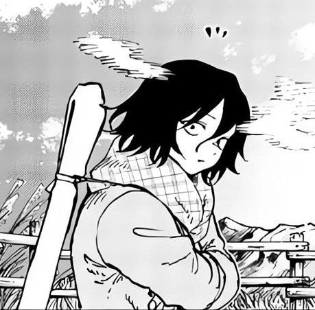

  <h1>Hello, World!</h1>

  
  
  
  

  <h3>"Все можно объяснить логически. Если нет - нужно копать глубже"</h3>

Простой паренек, лет 17, крайне веселый, забывчивый, тихий, меланхоличный _(Интроверт проще говоря-)_

###### P.S. Родился 02.12.2008 - На случай если забуду обновить свой возраст

- **Программирование - часть моей жизни**
- Вдохновляюсь от **проектирования архитектур** кодовой части _(бывает даже философствую)_
- Пишу в основном на **C++** с 9 лет
- И да, крайне тихий, _интроверсивный_ и забывчивый - предпочитаю тишину, _но могу ненадолго побыть в шумной компашке хаха :D_

 

## Имеются знания в области
- C++ _(Роднее чем русский язык)_
- Unreal Engine
- GLSL
- Python
- Java
- Linux
- Unity
- C#
- JavaScript/HTML/CSS
- Processing
- Arduino
- Raspberry Pi
- Физика, Математика, глубокое знание Электроники и хорошее понимание основ в Computer Science

## Текущие проекты
- [**Portal Solver**](https://gamejolt.com/games/PortalSolver/898591) - фан-игра, головоломка от первого лица, являющейся смесью **Portal 2** и **Murder Drones** сделанная на **Unreal Engine 5**
- [**Portal Solver API**](https://github.com/RootTool0/PortalSolverAPI) - Полностью открытый **API** для игры **Portal: Solver** на языке **Python**, имеющий в себе базовые инструменты, инструкции и документации для работы с редактором карт и всей игрой из кода
- [**A Cold Love Story Remaster**](https://github.com/RootTool0/ACLS_DEV) - Фан-ремейк визуальной новеллы **Лиама Викерса** 2015-го года
- [**RootShadeBox**](https://github.com/RootTool0/RootShadeBox) - Небольшой инструмент для локального написания шейдеров на **GLSL** _грубо говоря **ShaderToy**, но оффлайн_
- **Root Engine** - Собственный игровой движок на **C++**
- **Shoko UI Framework** - Compile-time фреймворк для создания UI на **C++**. _Вдохновлено **Epic Games's Slate UI Framework**_

## Завершенные проекты
- [**RootSAI**](https://github.com/RootTool0/RootSAI) - **Simple Assembler Interpreter** - минималистичный интерпретатор виртуального 8-битного процессора, написанный на **C++** в образовательных и экспериментальных целях
- [**RootEncoder**](https://github.com/RootTool0/RootEncoder) - Библиотека для Arduino для работы с ротационными энкодерами: Неограниченный счетчик кликов, удержаний и callback'ов через лямбды
- [**RootTM1637**](https://github.com/RootTool0/RootTM1637) - Библиотека для Arduino для работы с 4-значными 7-сегментными дисплеями на контроллере TM1637: Отображение времени, управление яркостью и точкой
- [**RootDS1302**](https://github.com/RootTool0/RootDS1302) - Библиотека для Arduino для работы с модулем времени DS1302: установка, чтение и обновление даты и времени
- [**RTPinBoard**](https://github.com/RootTool0/RTPinBoard) - Библиотека для Arduino для работы с красной 5-ти клавишной клавиатурой _(написана еще в юности)_

## Что-нибудь еще? Конечно, рад знакомству:
- ТГ-Канал: [RootTool Blog](https://t.me/RootToolBlog)
- ТГ-ЛС: [RootTool](https://t.me/RootTool28)
